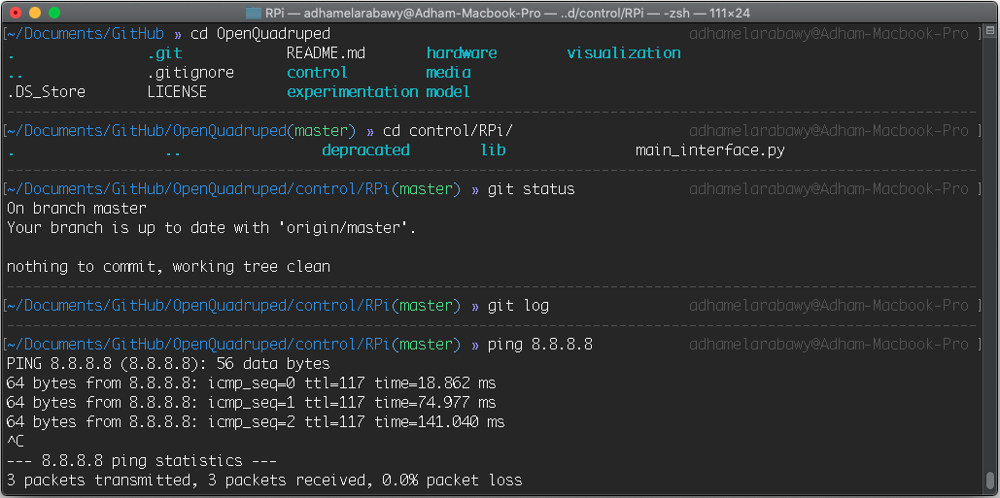
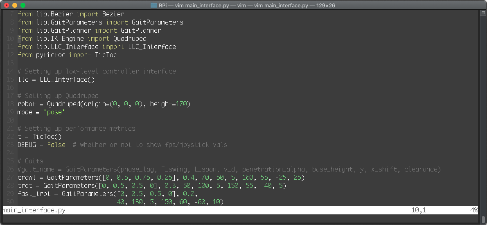

# dotfiles
My vim, tmux, & zsh dotfiles, along with instructions on how to use them.

## What does my setup look like?

Terminal:

vim:

## How to use?
1. Clone this repository into wherever you store your projects. (for me, this is `~/Documents/Github/[repo]`)
2. Make sure you've installed the necessary dependencies (vim, tmux, git, zsh).
2. Run the setup.sh script: `sh setup.sh`.
3. Restart your terminal. 
